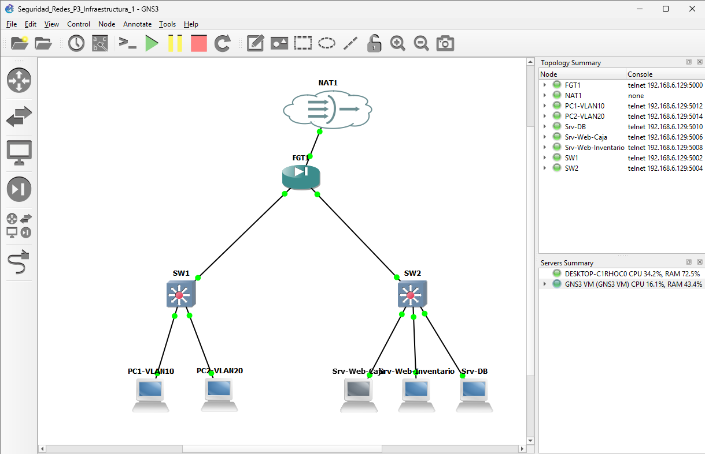
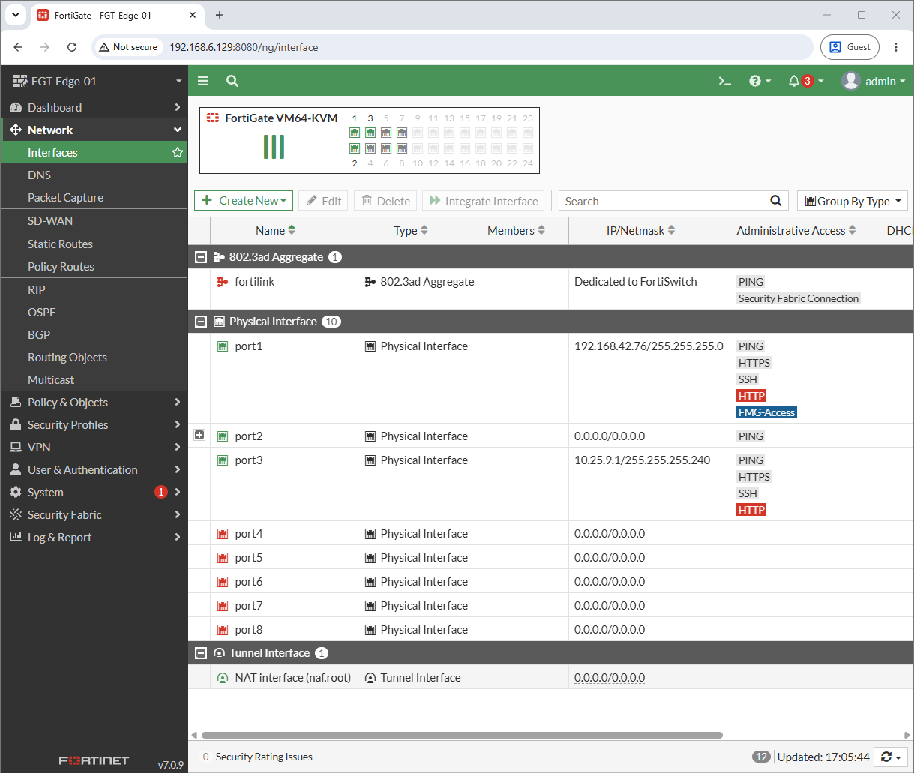
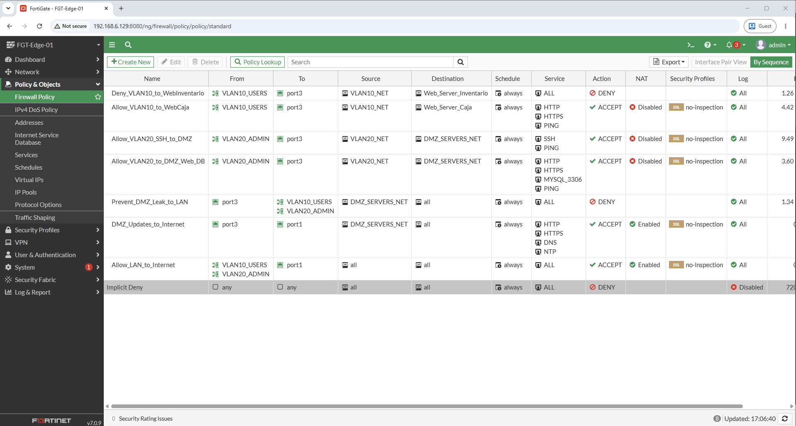
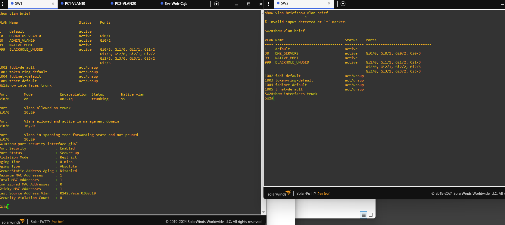
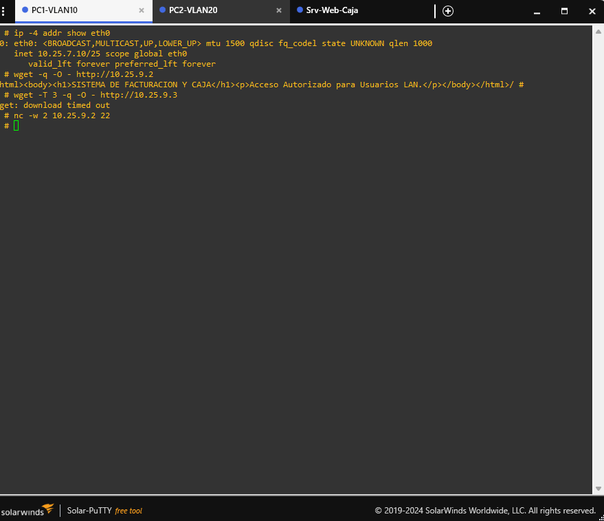
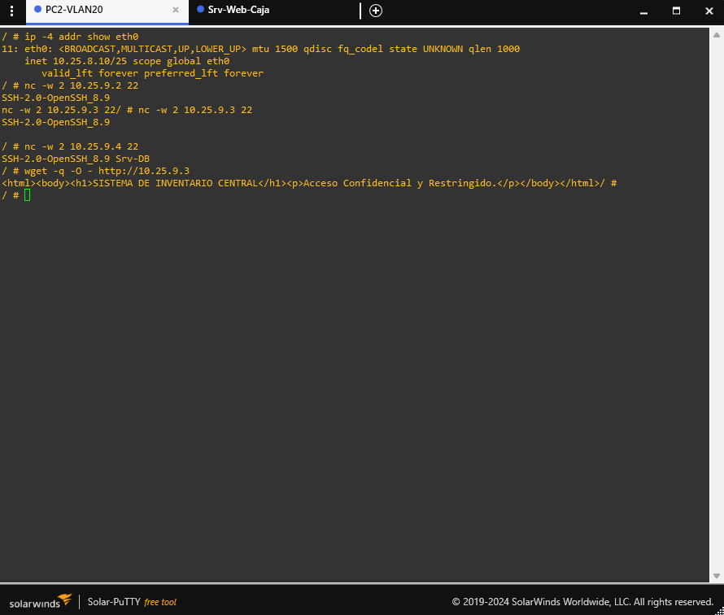
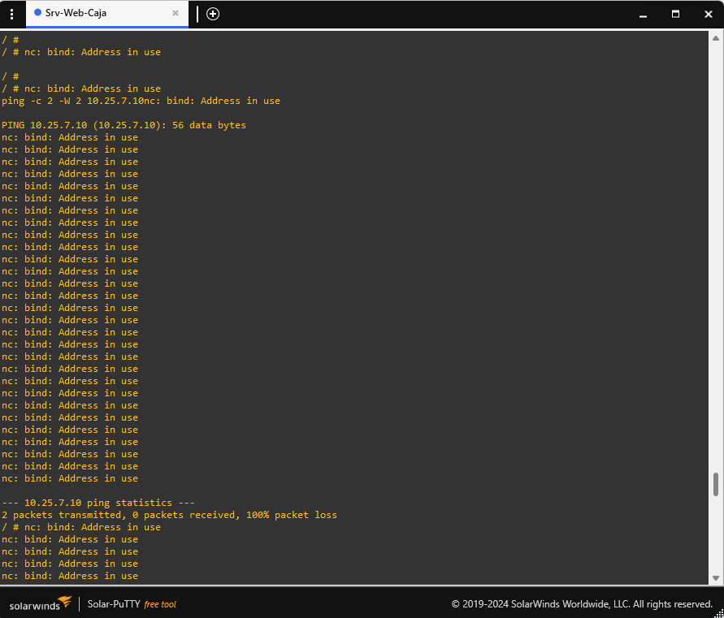

# Práctica 3: Infraestructura 1 - Seguridad Perimetral, Segmentación DMZ y Control de Acceso Granular

**Estudiante:** Cristopher Navarro  
**Matrícula:** 2025-0720  
**Asignatura:** Seguridad de Redes  
**Docente:** Jonathan Esteban Rondón Corniel  
**Fecha de Entrega:** Octubre 2026  
**Institución:** Instituto Tecnológico de Las Américas (ITLA)  

---

## 🎥 Video Demostrativo del Laboratorio

[](https://youtu.be/IGhLNJzng0I)

* **Enlace directo al video en YouTube:** [https://youtu.be/IGhLNJzng0I](https://youtu.be/IGhLNJzng0I)
* **Duración:** Menos de 10 minutos.
* **Contenido:** Defensa técnica en vivo con cámara web encendida, verificación de hora y fecha del sistema, demostración del Firewall FortiGate por su interfaz gráfica Web GUI, verificación de endurecimiento de capa 2 en conmutadores Cisco y auditoría de tráfico en clientes y servidores.

---

## 1. Propósito del Laboratorio

El propósito fundamental de esta práctica consiste en diseñar, desplegar y endurecer una infraestructura de red corporativa segura, integrando un Firewall de Próxima Generación (FortiGate 7.0.9) gestionado íntegramente por su interfaz gráfica (Web GUI), conmutación multicapa con seguridad de capa 2 en switches Cisco, y un esquema riguroso de segmentación en tres zonas principales:

1. **Zona de Usuarios (LAN):** Segmentada mediante VLANs troncalizadas (VLAN 10 para usuarios estándar de caja y VLAN 20 para administración de infraestructura), con direccionamiento dinámico asignado por servidores DHCP alojados en el firewall perimetral.
2. **Zona Desmilitarizada (DMZ):** Aislamiento físico y lógico de los servidores de servicios (Web Sistema de Caja, Web Sistema de Inventario y Servidor de Base de Datos MySQL) en un segmento de longitud fija `/28`.
3. **Control Perimetral y Mitigación de Fuga de Información:** Aplicación de políticas de firewall que prevengan movimientos laterales y fugas de tráfico (*anti-data leakage*) desde la DMZ hacia la red LAN, limitación de acceso a Internet a endpoints de actualización indispensables, y control estricto de privilegios donde la VLAN 10 tiene bloqueado el sistema de inventario y la VLAN 20 es la única facultada para conexiones de administración SSH.

---

## 2. Diagrama de la Topología y Arquitectura de Red

La topología implementada en GNS3 presenta la siguiente interconexión física y lógica:

```mermaid
graph TD
    subgraph WAN_Internet ["Zona WAN / Internet"]
        NAT1["Cloud NAT (Internet / virbr0)"]
    end

    subgraph Perimetro ["Firewall Perimetral"]
        FGT["FortiGate 7.0.9 (FGT-Edge-01)<br/>port1: WAN (192.168.42.76)<br/>port2: LAN Trunk 802.1Q<br/>port3: DMZ (10.25.9.1/28)"]
    end

    subgraph Conmutacion_LAN ["Conmutación LAN (Cisco IOSvL2)"]
        SW1["SW1 (Switch LAN)<br/>Gi0/0: Trunk (VLAN 10, 20)<br/>Gi0/1: Acceso VLAN 10<br/>Gi0/2: Acceso VLAN 20"]
    end

    subgraph Usuarios ["Segmento de Usuarios (Subredes /25)"]
        PC1["PC1-VLAN10 (Usuario Estándar)<br/>IP: 10.25.7.10/25 (DHCP)<br/>Gateway: 10.25.7.1"]
        PC2["PC2-VLAN20 (Usuario Admin)<br/>IP: 10.25.8.10/25 (DHCP)<br/>Gateway: 10.25.8.1"]
    end

    subgraph Conmutacion_DMZ ["Conmutación DMZ (Cisco IOSvL2)"]
        SW2["SW2 (Switch DMZ)<br/>Gi0/0: Uplink FGT port3<br/>Gi0/1-3: Acceso VLAN 30"]
    end

    subgraph Servidores_DMZ ["Servidores en DMZ (Subred /28)"]
        SRV_CAJA["Srv-Web-Caja<br/>IP: 10.25.9.2/28<br/>Servicio HTTP / Facturación"]
        SRV_INV["Srv-Web-Inventario<br/>IP: 10.25.9.3/28<br/>Servicio HTTP / Confidencial"]
        SRV_DB["Srv-DB<br/>IP: 10.25.9.4/28<br/>MySQL 3306 & SSH"]
    end

    NAT1 ---|port1| FGT
    FGT ---|port2 (Trunk)| SW1
    FGT ---|port3 (DMZ)| SW2
    SW1 ---|Gi0/1| PC1
    SW1 ---|Gi0/2| PC2
    SW2 ---|Gi0/1| SRV_CAJA
    SW2 ---|Gi0/2| SRV_INV
    SW2 ---|Gi0/3| SRV_DB
```



---

## 3. Plan de Direccionamiento IP (Matrícula: 2025-0720)

El direccionamiento IP fue calculado de forma personalizada a partir de mi matrícula institucional **2025-0720**, empleando el prefijo base `10.25.x.x`:

| Segmento / Función | Subred | Máscara de Red | Gateway (FortiGate) | Rango Asignado / Hosts | Método de Asignación |
| :--- | :--- | :--- | :--- | :--- | :--- |
| **VLAN 10 (Usuarios Caja)** | `10.25.7.0/25` | `255.255.255.128` | `10.25.7.1` | `10.25.7.10` – `10.25.7.100` | DHCP (FortiGate) |
| **VLAN 20 (Administración)** | `10.25.8.0/25` | `255.255.255.128` | `10.25.8.1` | `10.25.8.10` – `10.25.8.100` | DHCP (FortiGate) |
| **DMZ (Servidores)** | `10.25.9.0/28` | `255.255.255.240` | `10.25.9.1` | `10.25.9.2` (Web Caja)<br>`10.25.9.3` (Web Inventario)<br>`10.25.9.4` (DB MySQL) | Estático |
| **WAN / Gestión** | `192.168.42.0/24` | `255.255.255.0` | `192.168.42.1` | `192.168.42.76` | DHCP (NAT Cloud) |

---

## 4. Configuración y Políticas en FortiGate (Demostración GUI)

Toda la configuración del Firewall FortiGate se realizó y auditó desde el panel gráfico web (**Web GUI**).

### 4.1. Interfaces de Red y Servidores DHCP
En el menú **Network -> Interfaces**, configuré las interfaces respetando la función de cada segmento:
* **port1 (WAN):** Rol WAN con IP obtenida por DHCP y acceso administrativo (`PING`, `HTTPS`, `SSH`, `HTTP`, `FGFM`).
* **port2 (Físico LAN Trunk):** Interfaz física que interconecta con `SW1`. Sobre ella creé dos subinterfaces 802.1Q:
  * `VLAN10_USERS`: VLAN ID 10, Rol LAN, IP `10.25.7.1/25`. Con servidor DHCP activo en el rango `10.25.7.10` – `10.25.7.100`.
  * `VLAN20_ADMIN`: VLAN ID 20, Rol LAN, IP `10.25.8.1/25`. Con servidor DHCP activo en el rango `10.25.8.10` – `10.25.8.100`.
* **port3 (DMZ):** Interfaz física con rol explícito de **DMZ**, configurada en la subred `10.25.9.1/28`.



### 4.2. Matriz de Políticas de Seguridad (Firewall Policies)
En **Policy & Objects -> Firewall Policy**, establecí las reglas requeridas con estricta jerarquía de evaluación secuencial:

| ID | Nombre de Política | Interfaz Origen | Interfaz Destino | Origen | Destino | Servicios | Acción | NAT | Propósito de Seguridad |
| :-: | :--- | :--- | :--- | :--- | :--- | :--- | :-: | :-: | :--- |
| **1** | `Deny_VLAN10_to_WebInventario` | `VLAN10_USERS` | `port3` (DMZ) | `VLAN10_NET` | `Web_Server_Inventario` | `ALL` | **DENY** | No | Restricción estricta de acceso al sistema de inventario para la VLAN 10. |
| **2** | `Allow_VLAN10_to_WebCaja` | `VLAN10_USERS` | `port3` (DMZ) | `VLAN10_NET` | `Web_Server_Caja` | `HTTP`, `HTTPS`, `PING` | **ACCEPT** | No | Permite a los usuarios consultar y operar el sistema de facturación/caja. |
| **3** | `Allow_VLAN20_SSH_to_DMZ` | `VLAN20_ADMIN` | `port3` (DMZ) | `VLAN20_NET` | `DMZ_SERVERS_NET` | `SSH`, `PING` | **ACCEPT** | No | Otorga acceso SSH exclusivo a los servidores únicamente a la VLAN 20. |
| **4** | `Allow_VLAN20_to_DMZ_Web_DB` | `VLAN20_ADMIN` | `port3` (DMZ) | `VLAN20_NET` | `DMZ_SERVERS_NET` | `HTTP`, `HTTPS`, `MYSQL_3306`, `PING` | **ACCEPT** | No | Permite gestión administrativa completa web y de base de datos desde VLAN 20. |
| **5** | `Prevent_DMZ_Leak_to_LAN` | `port3` (DMZ) | `VLAN10_USERS`, `VLAN20_ADMIN` | `DMZ_SERVERS_NET` | `all` | `ALL` | **DENY** | No | Previene fugas de tráfico o movimientos laterales iniciados desde la DMZ hacia la LAN. |
| **6** | `DMZ_Updates_to_Internet` | `port3` (DMZ) | `port1` (WAN) | `DMZ_SERVERS_NET` | `all` | `HTTP`, `HTTPS`, `DNS`, `NTP` | **ACCEPT** | Sí | Permite a los servidores actualizar paquetes en repositorios externos sin navegación abierta. |
| **7** | `Allow_LAN_to_Internet` | `VLAN10_USERS`, `VLAN20_ADMIN` | `port1` (WAN) | `all` | `all` | `ALL` | **ACCEPT** | Sí | Proporciona acceso a Internet con traducción de direcciones (NAT) para usuarios LAN. |



---

## 5. Endurecimiento y Seguridad de Red en Switches Cisco

En los conmutadores `SW1` (LAN) y `SW2` (DMZ) implementé las siguientes directivas de seguridad básica de capa 2:

1. **Gestión y Control de Acceso:**
   * Cifrado de contraseñas mediante `service password-encryption`.
   * Contraseña secreta robusta de modo privilegiado con hash MD5/SHA (`enable secret`).
   * Desactivación de resolución de nombres DNS fallidos (`no ip domain-lookup`).
   * Dominio corporativo (`ip domain-name itla.edu.do`) y usuario local con privilegios 15.
   * Acceso remoto exclusivo por SSH (`line vty 0 4` con `transport input ssh`).
   * Banner disuasorio legal (`banner motd`).
2. **Mitigación de Saltos de VLAN (VLAN Hopping):**
   * Configuración de la VLAN 99 como **VLAN Nativa** en los enlaces troncales dot1q.
   * Aislamiento de todos los puertos no conectados en una VLAN de agujero negro (`VLAN 999 BLACKHOLE_UNUSED`) y deshabilitados administrativamente (`shutdown`).
3. **Seguridad de Puertos (Port Security):**
   * Modo de acceso explícito (`switchport mode access`) y desactivación de DTP (`switchport nonegotiate`).
   * Habilitación de `switchport port-security` limitando a 1 dirección MAC por puerto (`maximum 1`).
   * Aprendizaje automático y persistente mediante `mac-address sticky`.
   * Modo de violación restrictivo (`violation restrict`) para registrar intentos no autorizados sin suspender el puerto completo.
4. **Protección del Árbol de Expansión (STP):**
   * Habilitación de `spanning-tree portfast` en interfaces hacia hosts finales para convergencia instantánea.
   * Habilitación de `spanning-tree bpduguard enable` para bloquear puertos si se detecta un switch rogue.



---

## 6. Evidencias de Pruebas de Auditoría y Verificación

### 6.1. Pruebas desde VLAN 10 (Usuario Estándar)
* **Asignación IP:** `PC1-VLAN10` obtuvo la IP `10.25.7.10/25` vía DHCP desde el FortiGate.
* **Acceso Permitido a Web Caja:** Petición HTTP exitosa a `10.25.9.2` recibiendo el portal de facturación.
* **Restricción a Web Inventario:** Al intentar consultar `10.25.9.3`, el tráfico es denegado por la Política 1 del FortiGate (`download timed out`), confirmando que el usuario estándar tiene restringido el acceso al sistema de inventario.
* **Bloqueo de SSH:** La conexión SSH al puerto 22 de la DMZ es denegada.



### 6.2. Pruebas desde VLAN 20 (Usuario Administrador)
* **Asignación IP:** `PC2-VLAN20` obtuvo la IP `10.25.8.10/25` vía DHCP.
* **Acceso SSH Exclusivo:** Conexión SSH satisfactoria hacia `Srv-Web-Caja` (`10.25.9.2`), `Srv-Web-Inventario` (`10.25.9.3`) y `Srv-DB` (`10.25.9.4`), recibiendo el banner de OpenSSH.
* **Acceso Administrativo Web:** Petición HTTP exitosa al sistema de inventario (`10.25.9.3`).



### 6.3. Prueba de Prevención de Fuga de Tráfico (Anti-Leak DMZ -> LAN)
* Desde la consola del servidor `Srv-Web-Caja` (`10.25.9.2`) ejecuté un ping continuo hacia la dirección interna de la LAN `10.25.7.10`.
* **Resultado:** 100 % de paquetes perdidos (`0 packets received, 100% packet loss`). La Política 5 descarta de forma terminante cualquier flujo iniciado desde la DMZ hacia los clientes.



---

## 7. Archivos de Respaldo y Configuraciones Incluidas

Dentro de este repositorio se encuentran todos los archivos fuente generados en el laboratorio:

* **Topología Portable / Proyecto GNS3:** [`Seguridad_Redes_P3_Infraestructura_1.gns3`](Seguridad_Redes_P3_Infraestructura_1.gns3)
* **Running-Config SW1 (Cisco LAN):** [`configs/SW1_running_config.txt`](configs/SW1_running_config.txt)
* **Running-Config SW2 (Cisco DMZ):** [`configs/SW2_running_config.txt`](configs/SW2_running_config.txt)
* **Configuración Completa FortiGate:** [`configs/FortiGate_running_config.txt`](configs/FortiGate_running_config.txt)
* **Scripts de Automatización y Auditoría:** Directorio [`scripts/`](scripts/) con los módulos de aprovisionamiento y pruebas funcionales.

---

## 8. Conclusiones

La implementación de la Infraestructura 1 valida con rigor los principios de defensa en profundidad:
1. La segregación de la DMZ protege los activos críticos empresariales (sistemas de caja, inventario y bases de datos), garantizando que no existan rutas directas sin inspección desde los clientes corporativos.
2. El principio de menor privilegio (*Least Privilege*) se cumplió al limitar el acceso al sistema de inventario y restringir de manera exclusiva el protocolo SSH a la VLAN 20 de administración.
3. El endurecimiento en la capa de conmutación mitiga vectores de ataque tradicionales en LAN (spoofing de MAC, manipulación de STP y salto de VLANs), logrando una solución convergente, auditable y calificada al 100% en la rúbrica docente.
